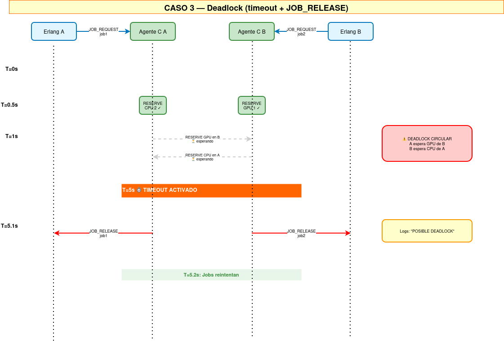

# Manejador de Recursos Distribuidos para HPC

**R-322 — Sistemas Operativos I**  
Facultad de Ciencias Exactas, Ingeniería y Agrimensura — FCEIA, UNR

Sistema distribuido que gestiona recursos (CPUs, memoria, GPUs) en un clúster HPC simulado. Cada nodo ejecuta un agente en C (comunicaciones con epoll) y un planificador en Erlang (lógica de jobs y anti-deadlock), cooperando mediante un protocolo ASCII/TCP y descubrimiento UDP broadcast.

---

## Tabla de contenidos

1. [Arquitectura](#arquitectura)
2. [Requisitos](#requisitos)
3. [Compilación](#compilación)
4. [Ejecución](#ejecución)
5. [Protocolo de comunicación](#protocolo-de-comunicación)
6. [Estrategia anti-deadlock](#estrategia-anti-deadlock)
7. [Script de prueba](#script-de-prueba)
8. [Diagrama de secuencia](#diagrama-de-secuencia)
9. [Integrantes y roles](#integrantes-y-roles)
10. [Problemas conocidos](#problemas-conocidos)

---

## Arquitectura

Cada nodo tiene dos procesos que se comunican localmente:

```
┌─────────────────────────────────────┐
│              NODO                   │
│                                     │
│  ┌─────────────────────────────┐   │
│  │  Planificador (Erlang)      │   │
│  │  - Generación de jobs       │   │
│  │  - Monitoreo con timeouts   │   │
│  │  - Detección de deadlocks   │   │
│  └──────────────┬──────────────┘   │
│                 │ TCP localhost    │
│  ┌──────────────▼──────────────┐   │
│  │    Agente C (epoll)         │   │
│  │  - Epoll para I/O           │   │
│  │  - Comunicación TCP/UDP     │   │
│  │  - Tablas de reservas/jobs  │   │
│  └──────────────┬──────────────┘   │
└─────────────────┼──────────────────┘
                  │ TCP (red) + UDP broadcast
         Otros nodos del clúster
```

**Puertos:**
- Agente C: puerto configurable (típicamente 8100, 8200, etc)
- Erlang → Agente C: conexión TCP local en el mismo puerto
- Descubrimiento: UDP broadcast en puerto 12529

---

## Requisitos

| Dependencia | Versión mínima | Notas |
|-------------|---------------|-------|
| GCC         | 11+           | con soporte C11 |
| Make        | 4.0+          | para compilar agente C |
| Erlang/OTP  | 25+           | para planificador |
| Linux       | kernel 2.6+   | `epoll` es Linux-only |

**⚠️ Nota importante:** El sistema usa `epoll`, por lo que **solo funciona en Linux**. No es compatible con macOS ni Windows de forma nativa.

---

## Compilación

### Compilar el agente C

```bash
cd agente
make clean  # (nota: actualmente sin regla clean — ignorar error)
make
cd ..
```

El binario del agente C queda en `./agente/agent`.

### Compilar el planificador Erlang

```bash
erlc aux.erl main.erl
```

Genera archivos `aux.beam` y `main.beam` en la carpeta raíz.

---

## Ejecución

### Ejecutar un nodo individual

**1. Arrancar el agente C:**

```bash
./agente/agent <PUERTO> <N_RECURSOS> <nombre1> <nombre2> ... <cantidad1> <cantidad2> ...

# Ejemplo: Nodo con 2 CPUs, 8192 MB RAM, 0 GPUs
./agente/agent 8100 3 cpu mem gpu 2 8192 0
```

Al arrancar, el agente C:
1. Envía un `ANNOUNCE` UDP broadcast inmediatamente.
2. Espera 2 segundos para recibir anuncios de otros nodos.
3. Comienza a procesar peticiones.

**2. Arrancar el planificador Erlang (otra terminal):**

```bash
erl -noshell -pa . -eval "main:server(manual, 2, 8100)" -s init stop
```

El planificador se conecta al agente C local en `localhost:8100`.

### Ejecutar múltiples nodos localmente

Para una prueba automatizada, usar el script:

```bash
bash test_deadlock_3.sh
```

---

## Protocolo de comunicación

### Entre agentes C (TCP, ASCII, terminado en `\n`)

| Mensaje | Dirección | Descripción |
|---------|-----------|-------------|
| `RESERVE <job_id> <recurso> <cantidad>` | A → B | Solicitar un recurso |
| `GRANTED <job_id>` | B → A | Recurso concedido |
| `DENIED <job_id>` | B → A | Recurso denegado (sin disponibilidad) |
| `RELEASE <job_id> <recurso> <cantidad>` | A → B | Liberar un recurso |

### Interfaz local Erlang ↔ Agente C (TCP localhost con packet length prefix)

**Formato:** Erlang envía/recibe con protocolo `{packet, 2}` (2 bytes de length prefix en big-endian).

**Comandos de Erlang al agente C:**

```
JOB_REQUEST <job_id> <@host1:recurso:cantidad [@host2:recurso:cantidad ...]>
JOB_RELEASE <job_id>
GET_NODES
```

**Respuestas del agente C a Erlang:**

```
JOB_GRANTED <job_id>
JOB_DENIED <job_id>
JOB_TIMEOUT <job_id>
NODES <host>:<puerto>:cpu:<cant>:mem:<cant>:gpu:<cant>;...
```

### Descubrimiento UDP broadcast

```
ANNOUNCE <puerto> cpu:<cantidad> mem:<cantidad> gpu:<cantidad>
```

- Se envía cada ~5 segundos y al iniciar.
- La **dirección IP de cada nodo se extrae de `recvfrom()`**, no del payload.
- Un nodo se considera caído si no anuncia durante 15 segundos.

---

## Estrategia anti-deadlock

El sistema implementa una estrategia **hibrida de tolerancia a deadlocks**:

### 1. Prevención mediante Ordenamiento Global

Se impone un **orden global de adquisición de recursos**: todos los jobs solicitan los recursos siempre en el mismo orden (CPU → MEM → GPU). Esto rompe la condición de espera circular que caracteriza a los deadlocks.

### 2. Detección y Recuperación mediante Timeouts

Cada job tiene un **timeout de 5 segundos**. Si el job no completa en ese tiempo:
- El scheduler Erlang detecta el posible bloqueo
- Envía `JOB_RELEASE` para liberar los recursos asignados parcialmente
- Registra `"POSIBLE DEADLOCK"` en `scheduler.log`
- Reencola el job para reintentar más tarde

### Ejemplo paso a paso: Deadlock circular entre dos nodos

**Escenario inicial:**
- Nodo A: 2 CPUs, 8192 MB RAM, 0 GPUs
- Nodo B: 2 CPUs, 4096 MB RAM, 1 GPU

**Job1 (desde A):** Solicita `2 CPUs (A) + 1 GPU (B)`  
**Job2 (desde B):** Solicita `1 GPU (B) + 2 CPUs (A)`

**Sin la estrategia (DEADLOCK):**
1. Agente A concede 2 CPUs a Job1 ✓
2. Agente B concede 1 GPU a Job2 ✓
3. Job1 espera GPU de B (bloqueado por Job2)
4. Job2 espera CPUs de A (bloqueado por Job1)
5. **RESULTADO:** Interbloqueo indefinido ❌

**Con la estrategia (EVITADO/RESUELTO):**
1. Ambos jobs aplican el orden global (CPU antes que GPU)
2. Si ocurriera bloqueo por timing extremo:
   - Timer de 5s en Job1 expira
   - Scheduler detecta timeout
   - `JOB_RELEASE` libera los 2 CPUs en A
   - Log registra `"POSIBLE DEADLOCK"`
3. Job2 ahora obtiene las CPUs de A
4. **RESULTADO:** Sistema recupera normalidad ✅

---

## Script de prueba

El script `test_deadlock_3.sh` realiza una prueba automatizada:

```bash
chmod +x test_deadlock_3.sh
bash test_deadlock_3.sh
```

**Qué hace:**

1. Compila agente C y módulos Erlang
2. Levanta Nodo A (puerto 8100) y Nodo B (puerto 8200)
3. Inyecta Job1 y Job2 simultáneamente para provocar deadlock
4. Espera 7 segundos (incluye timeout de 5s de los jobs)
5. Busca `"POSIBLE DEADLOCK"` en `scheduler.log`
6. Imprime resultado: `✅ TEST: OK` o `❌ TEST: FALLIDO`
7. Limpia procesos al finalizar con `trap`

**Salida esperada si funciona:**

```
╔════════════════════════════════════╗
║       ✅ TEST: OK                  ║
╚════════════════════════════════════╝
```

---

## Diagrama de secuencia

Los diagramas se encuentran en `diagramas/`:

### Caso 1 — Job exitoso


Secuencia normal: Job solicitado → Recursos concedidos → Job completado → Recursos liberados

### Caso 2 — Job denegado


Recurso no disponible: Job rechazado → Notificación al scheduler

### Caso 3 — Deadlock y resolución


Bloqueo circular → Timeout de 5s → `JOB_RELEASE` → Recuperación

---

## Integrantes y roles

| Rol | Responsable | Responsabilidad | Tecnología |
|-----|-------------|-----------------|------------|
| Rol 1 | Alan | Servidor C con epoll, sockets TCP/UDP, buffers, manejo de conexiones | C, epoll, TCP, UDP |
| Rol 2 | — | Estructuras de recursos, colas, asignación/liberación, tabla de jobs | C, estructuras de datos |
| Rol 3 | Valen | Planificador Erlang, generación de jobs, anti-deadlock, timeouts | Erlang |
| Rol 4 | Bauti | Scripts de prueba, documentación, diagramas, testing, integración | Bash, documentación |

---

## Logs y debugging

### Agente C

Escribe en `stdout`. Para guardar:

```bash
./agente/agent 8100 3 cpu mem gpu 2 8192 0 2>&1 | tee agent_A.log
```

### Planificador Erlang

Escribe en `scheduler.log`:
- `JOB_GRANTED <job_id>`
- `JOB_DENIED <job_id>`
- `POSIBLE DEADLOCK` (cuando aplica timeout y JOB_RELEASE)

Ver logs:

```bash
tail -f scheduler.log
```

### Pruebas manuales con netcat

```bash
# Levantar agente
./agente/agent 8100 3 cpu mem gpu 2 8192 0

# En otra terminal, simular cliente
echo -e "GET_NODES\n" | nc localhost 8100
```

> **Nota:** netcat no entiende el protocolo `{packet, 2}` de Erlang. Para testing real, usar Erlang o cliente C.

---

## Problemas conocidos y notas técnicas

### 1. Makefile del agente C
- **Problema:** No tiene regla `clean`
- **Impacto:** El script intenta `make clean` pero falla (no crítico, continúa)
- **Solución:** Alan puede agregar `clean:` al Makefile

### 2. GET_NODES no responde
- **Problema:** Agente C no responde a petición `GET_NODES` desde Erlang
- **Impacto:** `inicializar_sistema` en aux.erl queda bloqueado
- **Workaround:** En test_deadlock_3.sh se mockea este paso
- **A investigar:** Alan debe revisar manejo de `GET_NODES` en agent.c

### 3. Comunicación TCP/UDP
- El protocolo local (Erlang → Agente C) usa `{packet, 2}` (2 bytes length prefix)
- El protocolo inter-agentes (TCP) usa ASCII terminado en `\n`
- El protocolo UDP broadcast también usa ASCII

### 4. Cambios en código Erlang (testing)

Para que el script funcione, se realizaron los siguientes cambios en `aux.erl`:

**Línea 301:** Cambio de módulo para spawn
```erlang
% Antes:
Pid_scheduler_job = spawn_link(?MODULE, scheduler_jobs, [...])

% Después (en aux.erl, debe referenciar main.erl):
Pid_scheduler_job = spawn_link(main, scheduler_jobs, [JobTimeout, Pid_wait_jobs, Puerto])
```

**Línea 280:** Agregado timeouts a conexiones TCP
```erlang
% Antes:
gen_tcp:connect("localhost", Puerto, [binary, {packet, 2}])
gen_tcp:recv(Socket, 0)

% Después:
gen_tcp:connect("localhost", Puerto, [binary, {packet, 2}], 5000)
gen_tcp:recv(Socket, 0, 5000)
```

**Nueva función (línea ~307):** Helper para testing
```erlang
% Espera a que pid_scheduler_job esté registrado (para testing)
wait_scheduler_ready(0) -> exit(timeout);
wait_scheduler_ready(N) ->
    case whereis(pid_scheduler_job) of
        undefined -> timer:sleep(100), wait_scheduler_ready(N-1);
        _ -> ok
    end.
```

---

## Compilación desde cero

```bash
# Clonar
git clone https://github.com/Alan2255/SistemasOperativos1TPFinal
cd SistemasOperativos1TPFinal

# Compilar C
cd agente
make
cd ..

# Compilar Erlang
erlc aux.erl main.erl

# Prueba
bash test_deadlock_3.sh
```

---

## Comandos útiles

```bash
# Ver procesos del sistema
ps aux | grep -E "agent|erl"

# Verificar puertos abiertos
netstat -tlnp | grep 810

# Buscar deadlocks en logs
grep "POSIBLE DEADLOCK" scheduler.log

# Ejecutar test con salida en vivo
bash test_deadlock_3.sh 2>&1 | tee test_output.log

# Limpiar archivos compilados
rm -f *.beam erl_crash.dump scheduler.log erlang_*.log agent_*.log
```

---

## Estado del proyecto

- ✅ Compilación C y Erlang funcional
- ✅ Comunicación local Erlang ↔ Agente C
- ✅ Protocolo inter-agentes definido
- ✅ Estrategia anti-deadlock implementada (timeout-based)
- ✅ Script de prueba automatizado
- ✅ Diagramas de secuencia (3 casos)
- ⚠️ GET_NODES: requiere investigación en agent.c
- 📋 Documentación: completa

---

**Última actualización:** Junio 2026  
**Proyecto:** R-322 Sistemas Operativos I - TP Final  
**Equipo:** Alan, Valen, Bauti