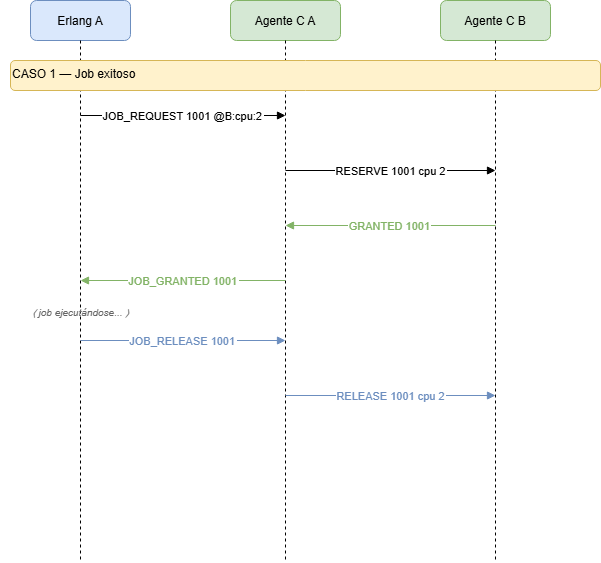
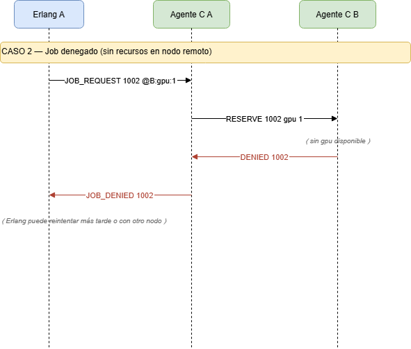

# Manejador de Recursos Distribuidos para HPC

**R-322 — Sistemas Operativos I**  
Facultad de Ciencias Exactas, Ingeniería y Agrimensura — FCEIA, UNR

Sistema distribuido que gestiona recursos (CPUs, memoria, GPUs) en un clúster HPC simulado. Cada nodo ejecuta un agente en C (comunicaciones con epoll) y un planificador en Erlang (lógica de jobs y anti-deadlock), cooperando con nodos de otros equipos mediante un protocolo común ASCII/TCP y descubrimiento UDP broadcast.

---

## Tabla de contenidos

1. [Arquitectura](#arquitectura)
2. [Requisitos](#requisitos)
3. [Compilación](#compilación)
4. [Ejecución](#ejecución)
5. [Protocolo de comunicación](#protocolo-de-comunicación)
6. [Estrategia anti-deadlock](#estrategia-anti-deadlock)
7. [Script de prueba](#script-de-prueba)
8. [Diagrama de secuencia](#diagrama-de-secuencia)
9. [Integrantes y roles](#integrantes-y-roles)

---

## Arquitectura

Cada nodo tiene dos procesos:

┌─────────────────────────────────────┐
│              NODO                   │
│                                     │
│  ┌─────────────┐   TCP localhost    │
│  │ Planificador│ ◄────────────────► │
│  │  (Erlang)   │                    │
│  └─────────────┘   ┌─────────────┐  │
│                    │ Agente C    │  │
│                    │ (epoll/TCP) │  │
│                    └──────┬──────┘  │
└───────────────────────────┼─────────┘
                            │ TCP (red) + UDP broadcast
                     otros nodos

El agente C escucha en un único puerto TCP:
- Conexiones desde `127.0.0.1` → interfaz local para Erlang
- Conexiones desde cualquier IP → interfaz para agentes remotos

---

## Requisitos

| Dependencia | Versión mínima | Notas |
|-------------|---------------|-------|
| GCC         | 11+           | con soporte C11 |
| Make        | 4.0+          | |
| Erlang/OTP  | 25+           | |
| Linux       | kernel 2.6+   | epoll es Linux-only |

> **Nota:** El sistema usa `epoll`, por lo que requiere Linux. No es compatible con macOS ni Windows de forma nativa.

---

## Compilación

```bash
# Clonar el repositorio
git clone https://github.com/Alan2255/SistemasOperativos1TPFinal
cd SistemasOperativos1TPFinal

# Compilar el agente C
make

# Compilar el planificador Erlang
cd erlang/
erlc scheduler.erl
# (o el nombre real del módulo — completar cuando esté listo)
```

El binario del agente C queda en `./agent` (o el nombre que defina el Makefile).

---

## Ejecución

### Iniciar un nodo

**1. Arrancar el agente C primero:**

```bash
./agent <PUERTO> <recursos>
# Ejemplo:
./agent 8100 cpu:4 mem:8192 gpu:1
```

Al arrancar, el agente:
1. Envía un `ANNOUNCE` UDP broadcast de forma inmediata.
2. Espera 2 segundos para recibir anuncios de nodos ya activos.
3. Comienza a atender peticiones normales.

**2. Arrancar el planificador Erlang (en otra terminal):**

```bash
erl -noshell -s scheduler start 8100
# (ajustar nombre de módulo y parámetros según implementación final)
```

El planificador se conecta automáticamente al agente C local en `localhost:8100`.

### Ejecutar múltiples nodos localmente (para pruebas)

```bash
# Nodo A — puerto 8100, recursos: 2 CPUs, 8 GB RAM
./agent 8100 cpu:2 mem:8192 &

# Nodo B — puerto 8200, recursos: 2 CPUs, 4 GB RAM, 1 GPU
./agent 8200 cpu:2 mem:4096 gpu:1 &

# Erlang A
erl -noshell -s scheduler start 8100 &

# Erlang B
erl -noshell -s scheduler start 8200 &
```

> Para una prueba automatizada del escenario de deadlock, ver [Script de prueba](#script-de-prueba).

---

## Protocolo de comunicación

### Entre agentes C (TCP, ASCII, terminado en `\n`)

| Mensaje | Dirección | Descripción |
|---------|-----------|-------------|
| `RESERVE <job_id> <recurso> <cantidad>` | A → B | Solicitar un recurso |
| `GRANTED <job_id>` | B → A | Recurso concedido |
| `DENIED <job_id>` | B → A | Recurso denegado (sin disponibilidad) |
| `RELEASE <job_id> <recurso> <cantidad>` | A → B | Liberar un recurso |

### Interfaz local Erlang ↔ Agente C (TCP localhost)

**Comandos de Erlang al agente C:**

| Comando | Descripción |
|---------|-------------|
| `JOB_REQUEST <job_id> [@host:res:amount ...]` | Solicitar recursos en uno o más nodos |
| `JOB_RELEASE <job_id>` | Liberar todos los recursos del job |
| `JOB_STATUS <job_id>` | Consultar estado de un job |
| `GET_NODES` | Obtener lista de nodos activos |

**Respuestas del agente C a Erlang:**

| Respuesta | Descripción |
|-----------|-------------|
| `JOB_GRANTED <job_id>` | Todos los recursos fueron asignados |
| `JOB_DENIED <job_id>` | Al menos un recurso fue denegado |
| `JOB_TIMEOUT <job_id>` | El job superó el tiempo de espera |
| `NODES <ip>:<puerto>:<res>:<val>:...;...` | Lista de nodos activos |

### Descubrimiento UDP broadcast

```
ANNOUNCE <IP> <puerto> <recurso>:<cantidad> [...]
# Ejemplo:
ANNOUNCE 192.168.1.10 8100 cpu:4 mem:8192 gpu:1
```

- Se envía periódicamente (cada ~5 segundos) y al iniciar.
- Un nodo se considera caído si no anuncia durante **15 segundos**.

---

## Estrategia anti-deadlock

> **TODO:** Completar esta sección con el Rol 3 (Erlang) una vez definida la estrategia.

El planificador Erlang implementa una estrategia de **[prevención / detección — completar]** de deadlocks distribuidos.

### Escenario de deadlock clásico

Con dos nodos:

- **Nodo A:** 2 CPUs, 8 GB RAM, 0 GPU
- **Nodo B:** 2 CPUs, 4 GB RAM, 1 GPU

Sin protección, si Job1 (desde A) pide `2 CPUs de A + 1 GPU de B` y Job2 (desde B) pide `1 GPU de B + 2 CPUs de A` al mismo tiempo:

1. Agente A concede 2 CPUs a Job1.
2. Agente B concede 1 GPU a Job2.
3. Cada uno queda esperando el recurso del otro → **deadlock**.

### Solución implementada

> **TODO:** Describir la estrategia (ej. ordering global de recursos, wait-die, wound-wait, timeouts con rollback, etc.) y un ejemplo paso a paso.

---

## Script de prueba

El script `test_deadlock.sh` levanta dos instancias locales y verifica el comportamiento ante un escenario de deadlock:

```bash
chmod +x test_deadlock.sh
./test_deadlock.sh
```

**Qué hace el script:**

1. Compila el agente C (`make`).
2. Lanza el Nodo A en el puerto `8100` con recursos `cpu:2 mem:8192`.
3. Lanza el Nodo B en el puerto `8200` con recursos `cpu:2 mem:4096 gpu:1`.
4. Espera que ambos se descubran por UDP.
5. Inyecta Job1 y Job2 simultáneamente para provocar el escenario de deadlock.
6. Verifica en los logs que el deadlock fue evitado/resuelto.
7. Imprime `[PASS]` o `[FAIL]` según el resultado.
8. Limpia los procesos al finalizar.

> Ver el archivo `test_deadlock.sh` para más detalles.

---

## Diagrama de secuencia

Los diagramas se encuentran en `diagramas`:

### Caso 1 — Job exitoso


### Caso 2 — Job denegado


### Caso 3 — Deadlock y resolución
> ⚠️ Pendiente hasta definir estrategia anti-deadlock con Rol 3.

---

## Integrantes y roles

| Rol | Responsabilidad | Tecnología |
|-----|-----------------|------------|
| Rol 1 — Ingeniero de comunicaciones C | Servidor C con epoll, sockets TCP/UDP, buffers, conexiones no bloqueantes | C, epoll, TCP, UDP |
| Rol 2 — Gestor de recursos y estado | Estructuras de recursos, colas FIFO, asignación/liberación, tabla de jobs | C, estructuras de datos |
| Rol 3 — Planificador y lógica anti-deadlock | Proceso Erlang, generación de jobs, estrategia anti-deadlock | Erlang |
| Rol 4 — Integración, pruebas e interoperabilidad | Scripts de prueba, documentación, diagramas, coordinación con otros equipos | Bash, documentación |

---

## Logs y debugging

El agente C escribe logs en `stdout`. Para guardarlos:

```bash
./agent 8100 cpu:4 mem:8192 2>&1 | tee agent_A.log
```

El planificador Erlang escribe concesiones, denegaciones y eventos de deadlock en `scheduler.log` (o `stdout` — confirmar con Rol 3).

Para probar el agente C con `netcat` antes de integrar Erlang:

```bash
# En una terminal: levantar el agente
./agent 8100 cpu:4 mem:8192

# En otra terminal: simular un cliente Erlang
echo "JOB_REQUEST 1001 @127.0.0.1:cpu:2" | nc localhost 8100

# Simular un agente remoto
echo "RESERVE 1001 cpu 2" | nc localhost 8100
```